# Transcriptomics Analysis of COPD vs Control Lung Tissue (GSE76925)

RNA-seq transcriptomic analysis of COPD versus healthy control lung tissue using the GSE76925 dataset, identifying differentially expressed genes and key biological pathways.

## Pipeline Overview

```mermaid
flowchart TD
    A[📦 Input: GSE76925_non-normalized.txt.gz\nIllumina HumanHT-12 v4 Microarray] --> B

    B[Step A — Data Import\nLoad packages · Read expression file\nSplit intensities vs detection p-values] --> C

    C[Step B — QC & Transformation\nFilter probes by detection p-val < 0.01 in ≥20% samples\nLog2 transform intensities] --> D

    D[Step C — Metadata & Phenotype\nDownload GEO metadata · Align sample IDs\nDefine COPD vs Control groups] --> E

    E[Step D — Exploratory PCA\nPCA scaled & unscaled · T-tests on PC1 & PC2\nBoxplots by group] --> F

    F[Step E — Differential Expression\nlimma · lmFit + eBayes · BH-adjusted FDR\nHeatmap · Volcano plot · MA plot] --> G

    G[Step F — Probe Annotation\nGPL10558 platform · Map Probe IDs\nto Gene Symbols & Entrez IDs] --> H

    H[Step G — Over-Representation Analysis\nGO Biological Process · Reactome ORA\nUp & Down gene sets separately] --> I

    I[Step H — Reactome GSEA\nRank all genes by limma t-statistic\ngsePathway · Enrichment curves] --> J

    J[Step I — Integrated Interpretation\nECM remodeling & SLIT-ROBO upregulated\nTranslational programs downregulated] --> K

    K[📁 Output: results/ folder\nlimma_sig_strong_annotated.csv\nGO & Reactome CSVs · HTML report]
```

## Key Findings

- **PC2** captures a significant disease-associated transcriptional axis in COPD lung tissue
- **Upregulated** in COPD: Extracellular matrix remodeling, SLIT–ROBO signaling pathways
- **Downregulated** in COPD: Translational machinery and ribosomal biogenesis programs
- Findings consistent across both ORA and rank-based GSEA

## Files

| File | Description |
|------|-------------|
| `Transcriptomics Analysis of COPD vs Control Lung Tissue-GSE76925.Rmd` | Main analysis script |
| `Transcriptomics-Analysis-of-COPD-vs-Control-Lung-Tissue-GSE76925.html` | Rendered HTML report |
| `GSE76925_non-normalized (2).txt.gz` | Raw expression data |
| `results/limma_sig_strong_annotated.csv` | Significant DE genes (FDR < 0.05, \|logFC\| > 0.5) |
| `results/GO_up_COPD.csv` | GO BP enrichment — upregulated |
| `results/GO_down_COPD.csv` | GO BP enrichment — downregulated |
| `results/Reactome_ORA_up.csv` | Reactome ORA — upregulated |
| `results/Reactome_ORA_down.csv` | Reactome ORA — downregulated |
| `results/Reactome_GSEA.csv` | Reactome GSEA results |

## Dataset

- **GEO Accession:** [GSE76925](https://www.ncbi.nlm.nih.gov/geo/query/acc.cgi?acc=GSE76925)
- **Platform:** GPL10558 — Illumina HumanHT-12 v4.0 Expression BeadChip
- **Tissue:** Human lung tissue
- **Comparison:** COPD patients vs healthy controls

## Author

Mayank Gandhi
